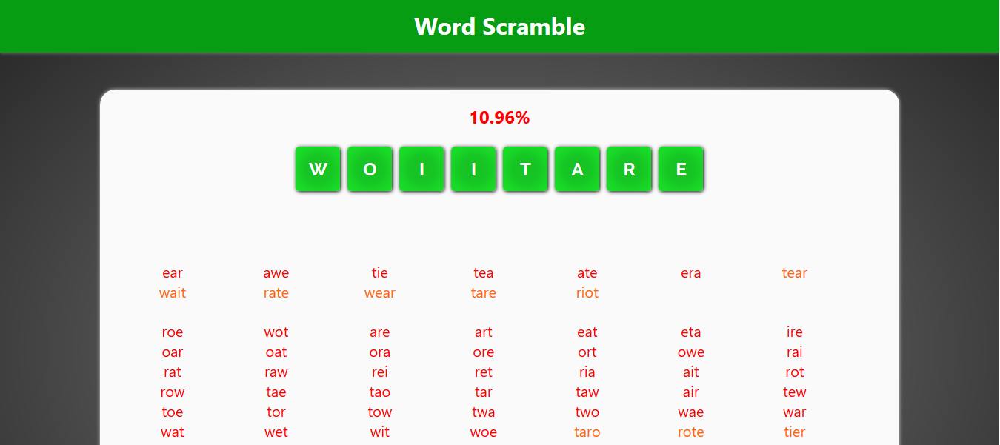

# WordScramble

A web-based game that tests your memory of english words.

[Play online!](https://jamesscn.github.io/wordscramble/)

**Description**

You are given a set of eight letters and sixty seconds to make as many words as possible using only those letters. Can you find all of the possible words within the time constraint? Can you make a word using all eight letters?

Each word you type can have a different score depending on its length; the longer the word, the more it contributes to your final percentage.

* 3 letters: 1 point
* 4 letters: 3 points
* 5 letters: 4 points
* 6 letters: 6 points
* 7 letters: 8 points
* 8 letters: 16 points